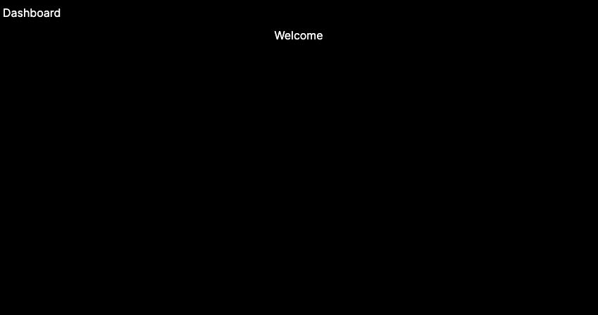
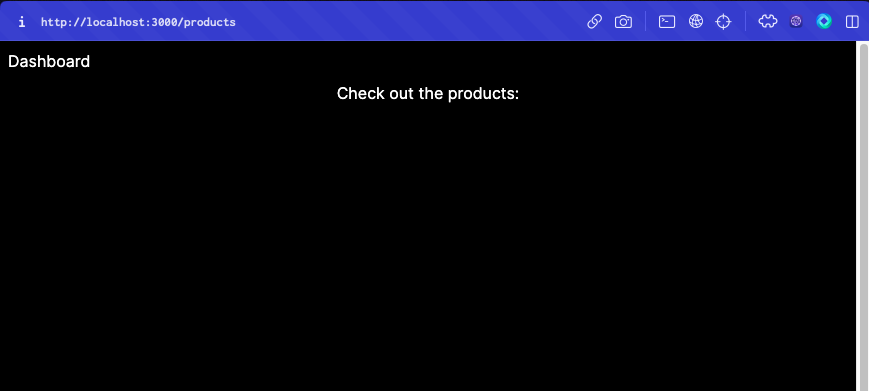
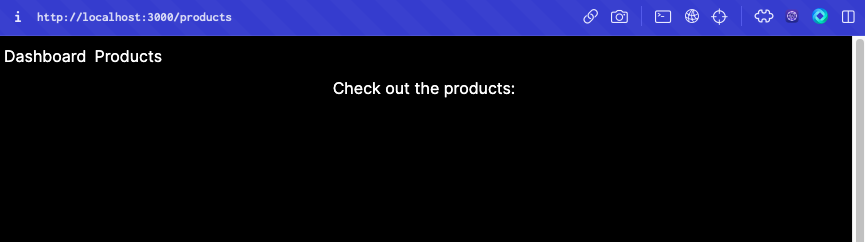
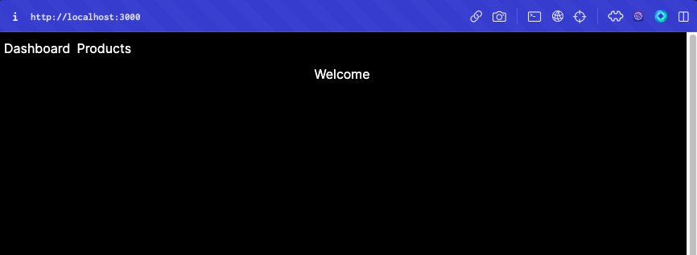

# Nextjs Dashboard Challenge !

## Description

The goal is to create a dashboard using the below set of technologies:

- Nextjs 13 (App router)
- Shadcn/ui
- Tailwindcss
- Drizzle ORM
- PlanetScale DB
- Vercel
- Clerk

## Pre-requisites

[Create a new Nextjs app](https://nextjs.org/docs/getting-started/installation#automatic-installation)

```
What is your project named? next-dashboard-challenge
Would you like to use TypeScript? Yes
Would you like to use ESLint? Yes
Would you like to use Tailwind CSS? Yes
Would you like to use `src/` directory? No
Would you like to use App Router? (recommended) Yes
Would you like to customize the default import alias? Yes
What import alias would you like configured? @/*
```

## Todos

- [ ] Recreate the screen below using the `app/layout.tsx` file for the navbar, and `app/page.tsx` for the content. Tailwindcss must be used for styling.
      

- [ ] Add a product page `app/product/page.tsx` that displays the following:
      

- [ ] Add navigation links to the navbar. `Dashboard` must navigate to root page, and `Products` must navigate to the product page. See below image for reference. The navbar must be available on all pages.
      
      

- [ ]
